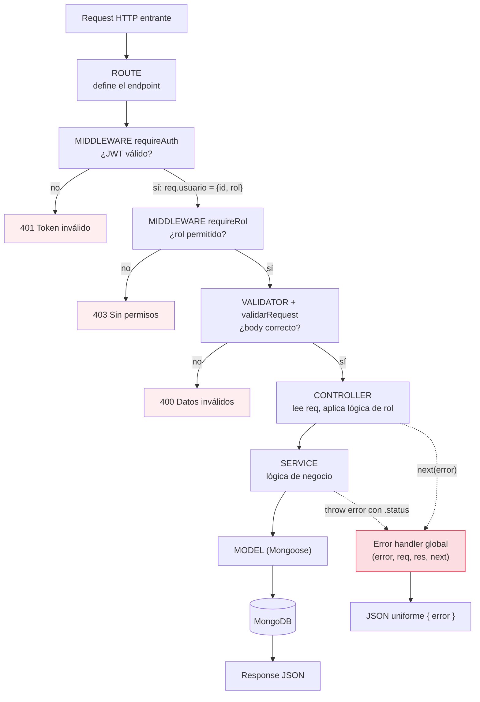
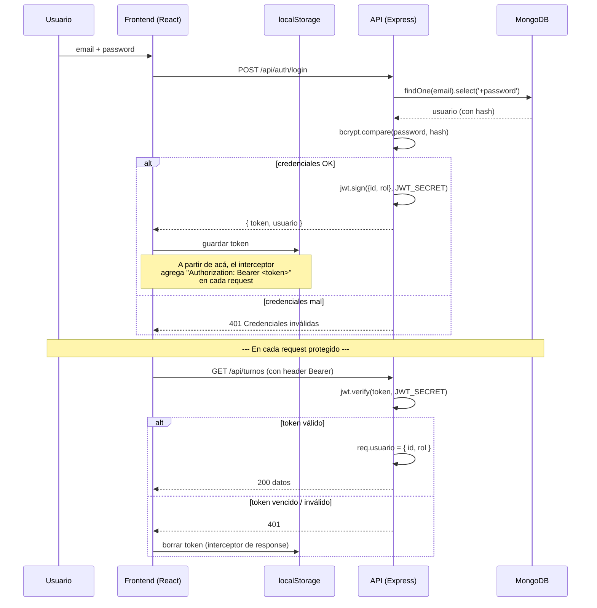
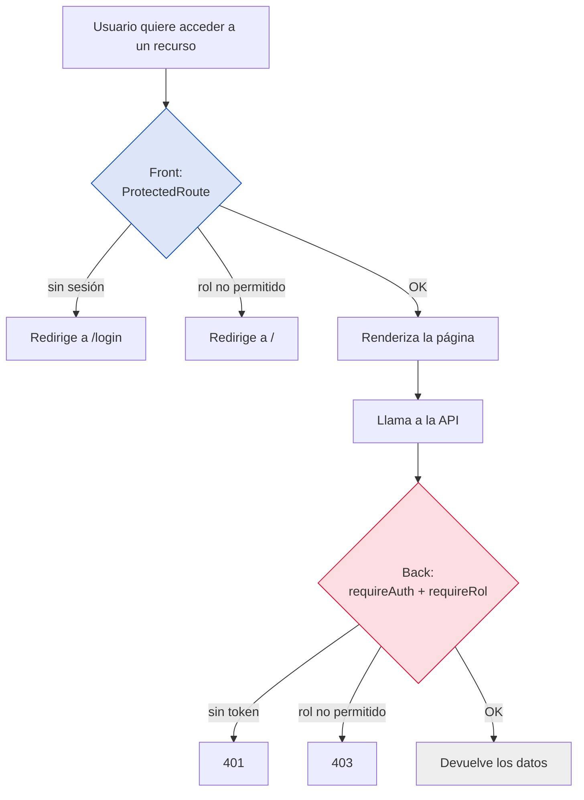
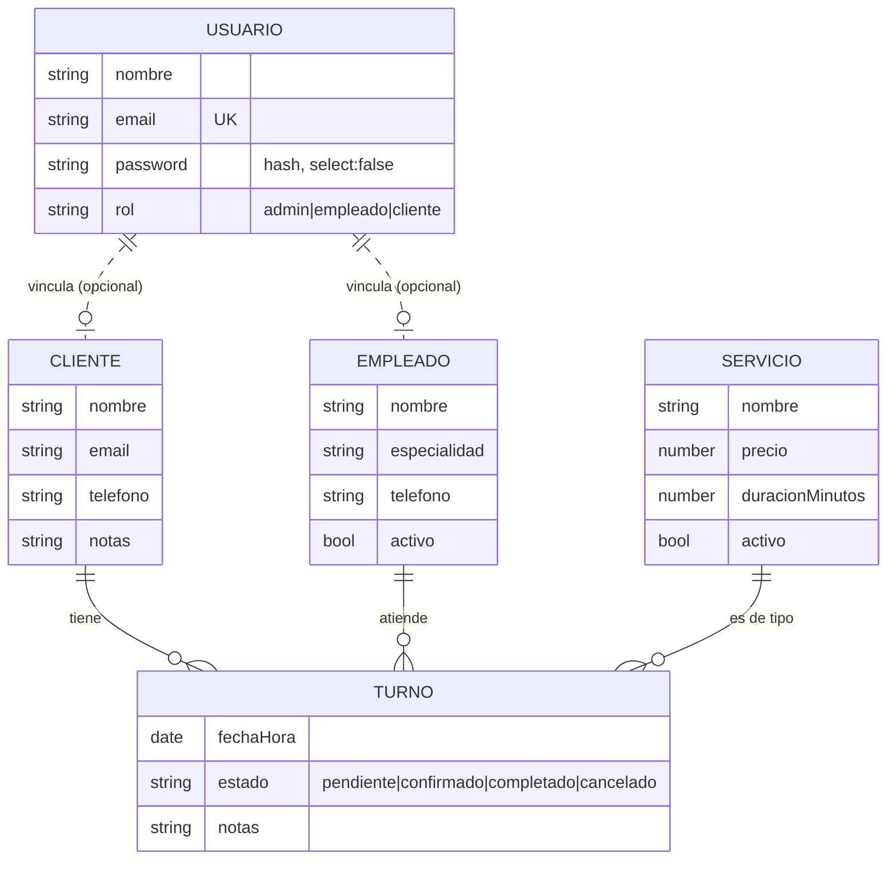

# Diagramas visuales — Peluquería SaaS

Diagramas en **Mermaid** (se renderizan solos en GitHub y en VS Code con la extensión Mermaid).
Sirven para fijar el modelo mental y, si el profe lo permite, mostrarlos en la defensa.

---

## 1. Arquitectura general (front ↔ back ↔ DB)

```mermaid
flowchart LR
    subgraph FRONT["FRONTEND — React + Vite"]
        UI["Páginas / Componentes"]
        CTX["AuthContext (estado global)"]
        API["Capa API (axios + interceptores)"]
        UI --> CTX
        UI --> API
        CTX --> API
    end

    subgraph BACK["BACKEND — Express (capas)"]
        R["Routes"]
        MW["Middlewares (auth + validación)"]
        C["Controllers (HTTP)"]
        S["Services (negocio)"]
        M["Models (Mongoose)"]
        R --> MW --> C --> S --> M
    end

    DB[("MongoDB Atlas")]

    API -- "HTTP /api (proxy Vite)" --> R
    M -- "consultas" --> DB

    style FRONT fill:#0044CC22,stroke:#0044CC
    style BACK fill:#E6002622,stroke:#E60026
    style DB fill:#0A0A0A11,stroke:#0A0A0A
```



**Para explicarlo:** "El front nunca toca la base directo. Habla por HTTP con la API, que está
organizada en capas: la ruta encadena middlewares, el controller maneja el HTTP, el service tiene
la lógica de negocio y el model habla con Mongo. Cada capa, una responsabilidad."

---

## 2. Ciclo de vida de un request (capas del backend)



**Para explicarlo:** "Un request atraviesa las capas en orden. Si algo falla, los controllers
delegan con `next(error)` al manejador global del final de `app.js`, que responde un JSON uniforme.
Por eso el handler tiene 4 parámetros: Express lo reconoce como error handler por la firma."

---

## 3. Flujo de autenticación con JWT



**Para explicarlo:** "El JWT se firma con el secreto del servidor. El payload `{id, rol}` se puede
leer (base64) pero no falsificar: si lo modificás, la firma deja de coincidir. El front lo guarda
en localStorage y el interceptor lo manda solo en cada llamada."

---

## 4. Autorización por rol (doble barrera)



**Frase clave:** "El front es solo UX — evita mostrar pantallas inútiles. La seguridad real está
en el backend, porque el front se puede saltear con Postman."

---

## 5. Modelo de datos y relaciones



**Para explicarlo:** "El Turno es el centro: referencia a Cliente, Empleado y Servicio por ObjectId.
Cuando devuelvo turnos uso `populate` para reemplazar esos ids por los datos reales, trayendo solo
los campos que el front necesita."

---

## 6. La regla de solapamiento de turnos (visual)

```
Turno NUEVO:           [inicio ============ fin]

Caso A — NO se superpone (termina antes):
  [existente]  [inicio ====== fin]
            ↑ a2 <= b1

Caso B — NO se superpone (empieza después):
                       [inicio ====== fin]  [existente]
                                          ↑ b2 <= a1

Caso C — SÍ se superpone:
              [existente =======]
       [inicio ========= fin]
              ↑ a1 < b2  Y  b1 < a2   ← ambas verdaderas

REGLA:  se superponen  ⟺  a1 < b2  &&  b1 < a2
```

**Para explicarlo:** "Solo NO se superponen si uno termina antes de que el otro empiece. Negando
eso queda `a1 < b2 && b1 < a2`. En Mongo pre-filtro por `fechaHora < fin` (cubre `a1 < b2`) y en JS
chequeo `tFin > inicio` (cubre `b1 < a2`), calculando el fin con la duración del servicio."
